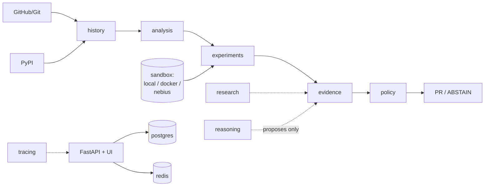

# UNBODGE — evidence-gated autonomous maintenance

UNBODGE does not ask whether a workaround *looks* obsolete. It reconstructs
the conditions that created it and tests whether the upstream fix has made
it unnecessary. **LLM confidence is never proof.**

```
event → investigation → workaround → causal hypothesis
  → historical reconstruction → counterfactual execution (A/B/C/D)
  → evidence validation → regression testing
  → policy decision → PR or ABSTAIN
```

Canonical proof: `OLD+workaround PASS`, `OLD-workaround FAIL`,
`NEW±workaround PASS`, regression PASS, evidence VALID →
`PROPOSE_REMOVAL`. Anything less → `ABSTAIN`, no PR.

## Quickstart

```bash
pip install -e ".[dev]"   # or: pip install pydantic packaging pytest fastapi httpx
PYTHONPATH=packages python -m pytest -q        # full suite (offline-safe)
PYTHONPATH="packages;tests" python scripts/demo.py   # under-3-minute demo
```

Requires Docker only for real-container execution tests; everything else
(including the synthetic proof) runs offline. Credential-dependent tests
(Nebius/Tavily/LangSmith/Temporal/cloud) are isolated and skip explicitly.
Zero external credits are consumed by the suite.

## Architecture


Solid arrows: authority path (deterministic). Dashed: advisory/observability.
Reasoning and research can never authorize removal; the policy gate reads
only validated evidence, regression results, and the counterfactual matrix.

See `docs/` for the full architecture, benchmark methodology, security
model, Nebius usage, demo script, and deployment instructions.

## API

Eleven endpoints (`packages/api`), plus four server-rendered views under
`/ui/` (dashboard, causal graph, proof, evidence ledger/PRs). No chatbot.

## Benchmark

`unbodge-history-v1`: 10 cases (2 measured OBSOLETE, 3 measured
AMBIGUOUS, 5 honest UNPROVABLE). Baselines: LLM-only, LLM+search,
no-counterfactual, full UNBODGE. See `docs/BENCHMARK.md` — targets are
labeled TARGET, never presented as results.

## Security model

See `docs/SECURITY.md`. Highlights: allowlist command validation, secret
redaction on public evidence (raw records immutable), HMAC webhooks,
sandbox isolation (`--network none`, caps, cleanup), offline test
enforcement.

## License

MIT — see `LICENSE`.
